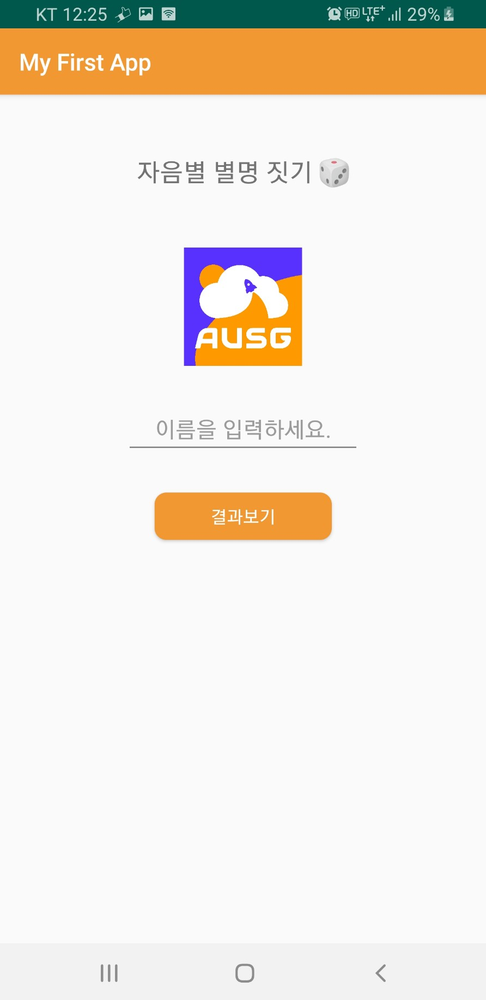
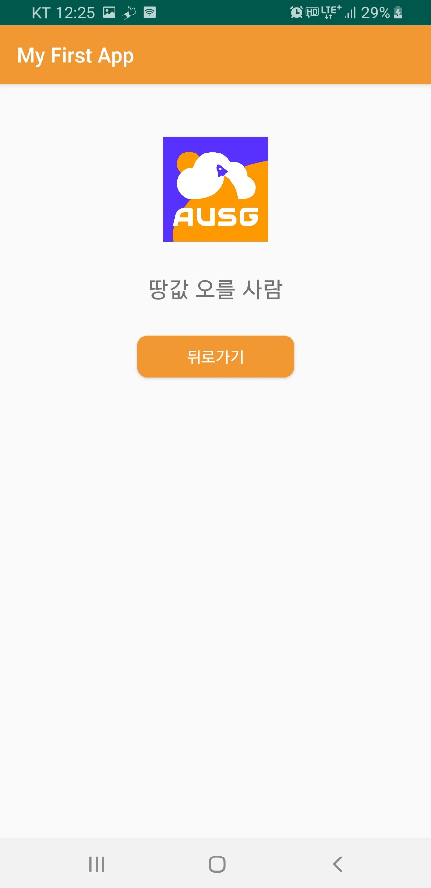

# Android 개발환경 설정

안드로이드 개발 시작을 위해 개발환경을 설정해봅시다.😎

본 과정은 

- JDK설치
- Android Studio 설치

개발 테스트를 위한

- Android Virtual Device(Emulator) 설치
- 핸드폰 개발자 설정

을 포함합니다.

### [설치 가이드 for MAC](./mac-guide.md)

### [설치 가이드 for window](./window-guide.md)

### [Android 시작 전에 알아야 할 기초지식(PDF)](https://bit.ly/2Ptff67)

---

## 설치가 끝난 후 첫 안드로이드 프로젝트를 만들어 보실 수 있도록 간단한 샘플 프로젝트(JAVA)를 포함해두었습니다!

### 이름을 입력받아 미리 설정된 초성의 별명을 보여줍니다🤗

#####  <메인 화면>

  

##### <결과 화면>

  

### 즐거운 안드로이드 개발되세요!
