# Android 개발환경 설정 for Window 🖼

## 설치 순서

### 1. JDK 설치
### 2. Android Studio 설치
### 3. Android Emulator 설치 (선택)
### 4. Android 모바일 기기 개발자 모드 설정 (선택)

설치는 위 순서대로 진행되며 중간의 과정 중에 설치되어 있는 것들이 있다면 건너뛰셔도 됩니다. 🤗

## **!! 안드로이드 핸드폰을 소유하고 계시다면 4번 과정을 소유하고 있지 않으시다면 3번 과정을 진행해주세요.**

---

## 1. JDK 설치 

안드로이드는 Java(Kotlin), xml을 사용하여 코딩합니다. 따라서 JDK를 설치하여야 합니다.

PC에 Java가 이미 설치되어있다면 이 과정을 뛰어넘으셔도 됩니다.

cmd에서 

~~~
 java
~~~

명령어를 입력하셨을 때 아래와 같이 화면이 뜬다면 설치를 건너뛰셔도 좋습니다.


---

### 1. Oracle 페이지 접속

https://www.oracle.com/technetwork/java/javase/downloads/jdk12-downloads-5295953.html

### 2. JDK 다운로드

[Java SE Development Kit 12.0.1]에서 1번과 같이 [Accept License Agreement]를 선택한 후 windows 설치


(exe, zip 둘 중 어느 것을 택하셔도 무관합니다.)

---

### 3. JDK 설치

다운받은 파일을 통해 JDK를 설치해줍니다.

---

### 4. JDK 환경 변수 설정 - JAVA_HOME

[시작] - [제어판] - [시스템] - [고급 시스템 설정] - [고급] - [환경 변수] 까지 클릭합니다.

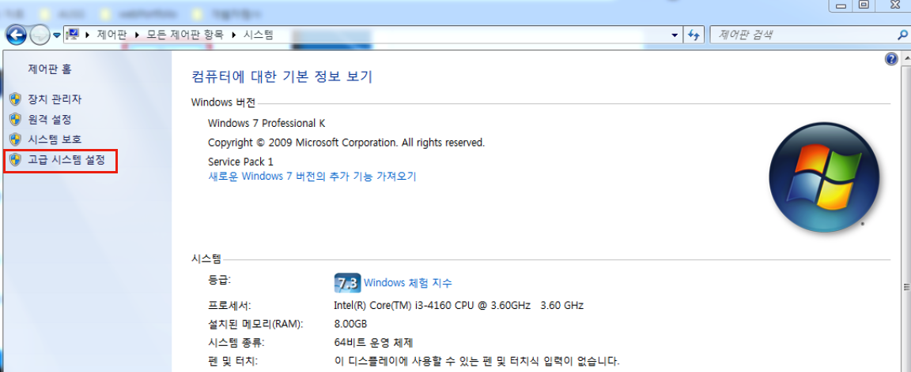

---

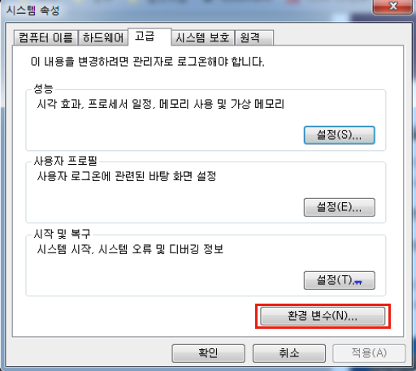


---

JAVA_HOME 환경변수를 추가해 줄 것입니다. 

위 과정을 모두 거치셨다면 아래와 같은 화면이 보일 것입니다.


만약 [시스템 변수] 목록에 JAVA_HOME이 있다면 항목을 더블 클릭하여 주시고 없다면 [시스템 변수] 하단의 [새로 만들기]를 클릭합니다.

JAVA_HOME 변수가 있고 변수 값이 존재한다면 

~~~
;C:\Program Files\Java\jdk-12.0.1
~~~

존재하지 않는다면 변수 이름에 JAVA_HOME을 입력하고

~~~
C:\Program Files\Java\jdk-12.0.1
~~~


를 [변수 값] 맨 뒤에 추가하고 [확인]을 클릭해주세요

---

### 5. JDK 환경 변수 설정 - Path

JAVA_HOME과 마찬가지로 이번에는 Path변수를 추가해 줄 것입니다.

[시스템 변수] 목록에 Path가 있다면 항목을 더블 클릭하여 주시고 없다면 [시스템 변수] 하단의 [새로 만들기]를 클릭해주세요.

Path 변수가 있고 변수 값이 존재한다면 

~~~
;%JAVA_HOME%\bin
~~~

존재하지 않는다면 변수 이름에 Path를 입력하고

~~~
%JAVA_HOME%\bin
~~~


를 [변수 값] 맨 뒤에 추가하고 [확인]을 클릭해주세요

---

아래 창에서도 [확인]을 클릭해주세요.


---

### 6. JDK 설치 확인

터미널 창을 열어 아래와 같이 입력하였을 때 
```
java
```
다음과 같이 나오면 설치가 완료된 것 입니다.


## 2. Android Studio 설치

안드로이드는 주로 Intelli J 기반 IDE Android Studio를 통해서 프로젝트를 진행합니다. Android Studio는 레이아웃 미리보기, 여러 편리한 단축키를 제공하므로 설치해보도록 하겠습니다.

### 1. developer.android 접속

https://developer.android.com/studio/

페이지에 접속하여 아래와 같은 화면에서 [Download Android Studio]를 클릭하여 IDE를 설치해줍니다. 자동으로 OS에 맞는 버전이 선택됩니다. 


팝업된 창에서 안내되는 policy를 동의한 후 [DOWNLOAD ANDROID STUDIO FOR WINDOW]을 클릭해줍니다.

### 2. Android Studio 설치

다운받은 exe파일을 통해 Android Studio를 설치해줍니다.


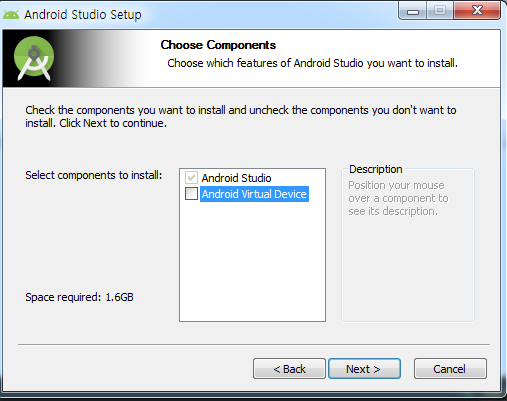

위와 같은 화면에서 [Android Virtual Device]를 해제해 주세요.

---

설치가 처음이라면 아래와 같은 화면이 뜹니다. [Do not import settings]를 선택 후 [OK]를 눌러주세요.

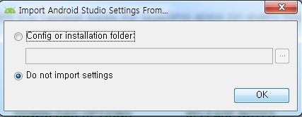

---

Install Type은 [Standard] 옵션을 선택 후 [Next]를 눌러주세요.


---
### 4. Android Studio 설치 확인

설치가 완료되고 Android Studio를 실행하면 아래와 같은 화면이 열립니다.

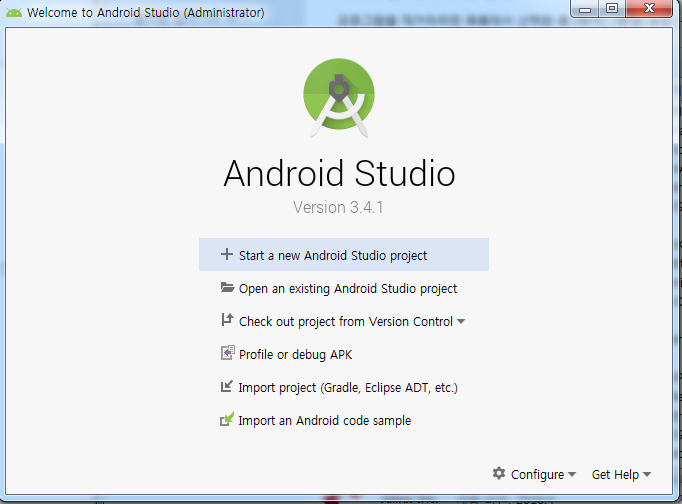

~~~
 Android는 버전 별로 SDK가 존재하며 해당 버전으로 빌드하기 위해서 해당 버전의 SDK가 필요합니다. 
 Android Studio 설치 시에 최신 버전이 설치됩니다.
~~~

## 3. Android Emulator 설치 (선택)

안드로이드 기기를 가지고 있지 않다면 컴퓨터에 Emulator를 설치하여 코딩한 결과를 컴퓨터에서 확인할 수 있습니다. 실제 모바일 기기에 비해 다소 느리지만 기기가 없을 경우 유용하게 사용할 수 있습니다.

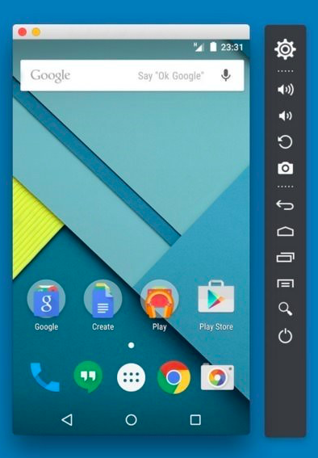

### 1. Android Virtual Device Manager

아래와 같은 Android Studio에서 하단의 [Configure] 클릭 후 [AVD Manager]를 클릭해줍니다.

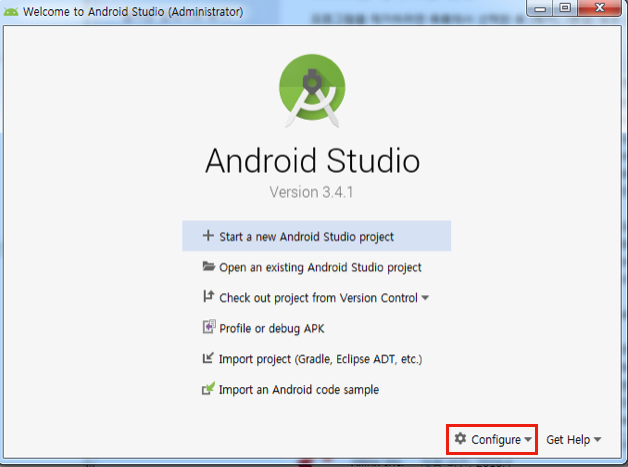

### 2. Emulator 설치

팝업된 창에서 [Create Virtual Device..]를 클릭한 후 필요한 핸드폰 기종[Pixel 2]을 선택한 후 [Next]를 클릭합니다.

---

다음 Android Image 선택화면에서 필요한 버전[Pie]을 선택하고 버전에 download가 있다면 클릭하여 필요 Image를 설치해줍니다.

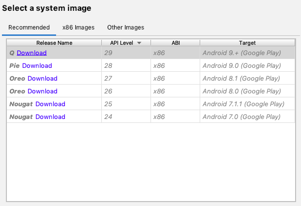

[Next] 버튼을 계속 클릭하여 설치를 완료해줍니다.

## 4. Android 모바일 기기 개발자 모드 설정 (선택)

안드로이드 기기를 가지고 계신 분들은 코딩한 결과를 바로 기기에 설치하여 테스트해 볼 수 있습니다. 이 때 컴퓨터와 기기를 연결하기 위해 **개발자 모드**를 활성화 해주어야 합니다. 

- 본 안내서는 Galaxy 핸드폰을 기준으로 작성되었습니다.
- **Window에서는 모바일 기기에 맞는 USB Driver가 설치되지 않았을 시 PC와 모바일 기기가 연결이 안 될 수 있습니다. 각 모바일 기기에 맞는 USB Driver를 설치해주세요.**

### 1. Android 개발자 모드 활성화

설정 앱 또는 기기 상단의 Notification Bar의 아래 아이콘을 통해 Android 설정을 열어줍니다.

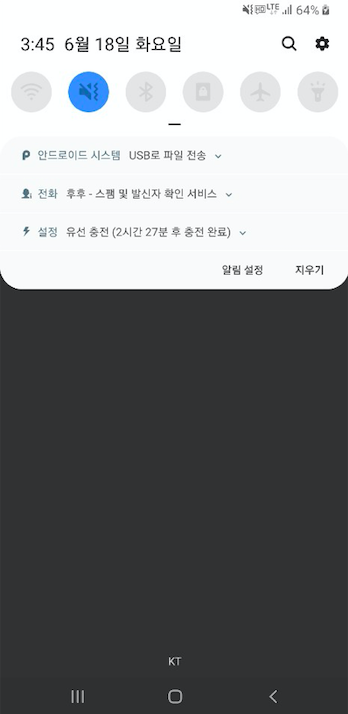

메뉴 가장 하단의 [휴대전화 정보]를 터치해줍니다.


[소프트웨어 정보] 메뉴를 터치해줍니다.

[빌드 번호]를 [개발자 모드가 활성화되었습니다.] 라는 메시지가 뜰 때까지 연달아 터치해줍니다.

[설정] 제일 처음 화면([휴대전화 정보] 메뉴가 있는 화면)까지 나오면 아래와 같이 [개발자 옵션] 메뉴가 추가되어 있습니다.


### 2. USB 디버깅 허용

[개발자 옵션]을 터치하면 아래와 같이 디버깅 파트에 [USB 디버깅]이 있습니다. 활성화 해줍니다.

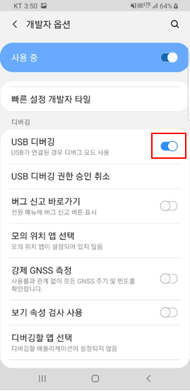

컴퓨터와 핸드폰을 연결하였을 때 아래와 같은 화면이 표시되면 [이 컴퓨터에서 항상 허용]을 선택한 후 확인을 선택해줍니다.

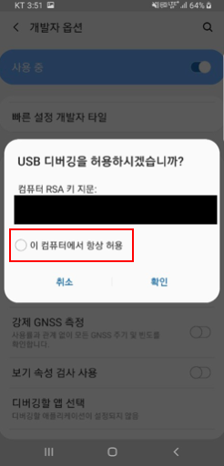

## 이제 Android Studio를 통해 프로젝트를 코딩하고 핸드폰 또는 Emulator에서 결과를 확인할 수 있습니다!